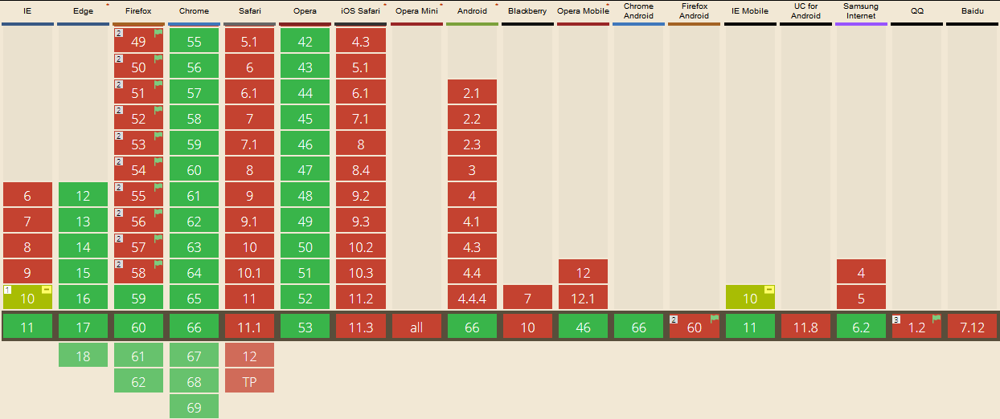

# 移动端 Click 300 毫秒延迟的来龙去脉
## 原文链接
http://www.linovo.me/front/webapp-300ms.html

## 看后小结
### 原因
2007 年，没有兴起响应时设计，当时的网站都是为大屏幕设计，iPhone 的工程师未来方便网站在手机上浏览，做了一些约定，其中很有名的一个就是 double tap to zoom (双击缩放)。在 IOS 中 Safari 浏览器中，手指在屏幕上快速点击两次，浏览器会将网页缩放至原始比例。

假定一个场景，用户在 IOS Safari 里面点击一个链接，由于用户可以进行双击缩放或者双击滚动操作，当用户点击一次之后，浏览器并不能立刻判断用户是要打开这个链接，还是想要进行双击操作。因此，Safari 就等待 300 毫秒，用来判断用户是否再次点击了屏幕。

于是，300 毫秒的延迟就产生了。

### 浏览器开发商提供的解决方案
1. 禁止缩放
使用 meta 标签禁止缩放，现在很多手机端页面都使用了这钟标签。
```html
<meta name="viewport" content="width=device-width, user-scalable=no, initial-scale=1.0, maximum-scale=1.0, minimum-scale=1.0">
```
最早实现这个功能的浏览器是 Android 平台的 Chrome 浏览器。这种方式会全面的禁用缩放，对于需要缩放的功能，例如图片查看，都需要另外进行实现。这种方式在 Safair 上并不支持。
经过测试，在手机端，Chrome 浏览器有效，firefox和safari无效。
手机端访问如下

2. 指针事件 (Pointer Events)
指针事件的提出，是为了减少不同输入类型的编码成本，和用鼠标描述事件的模糊性。它会对所有输入类型，包括鼠标 (mouse)、触摸 (touch)、触笔 (pen) 等，进行统一的处理。现在的支持程度是



这个是尝试的测试页面，手机端访问如下。

3. CSS 属性 touch-action

## 参考链接
- https://caniuse.com/#search=Pointer%20Events
- https://caniuse.com/#search=touch-action
- [pointerevent](https://www.w3.org/TR/pointerevents/#pointerevent-interface)