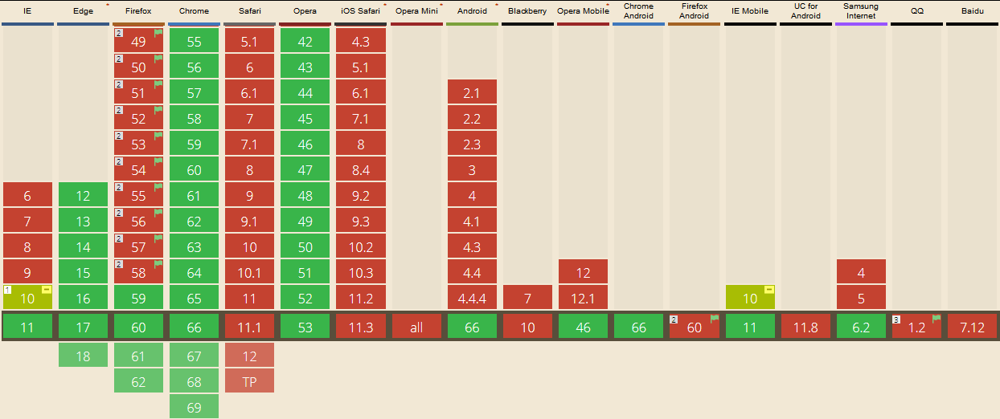
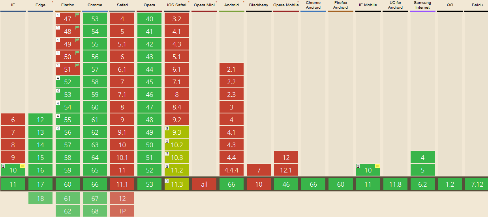

# 移动端 Click 300 毫秒延迟的问题
## 原文链接
原文：[What Exactly Is..... The 300ms Click Delay](https://www.telerik.com/blogs/what-exactly-is.....-the-300ms-click-delay)

译文：http://www.linovo.me/front/webapp-300ms.html

## 看后实践小结
### 原因
2007 年，没有兴起响应时设计，当时的网站都是为大屏幕设计，iPhone 的工程师为了方便网站在手机上浏览，做了一些约定，其中很有名的一个就是 double tap to zoom (双击缩放)。在 IOS 中 Safari 浏览器中，手指在屏幕上快速点击两次，浏览器会将网页缩放至原始比例。

假定一个场景，用户在 IOS Safari 里面点击一个链接，由于用户可以进行双击缩放或者双击滚动操作，当用户点击一次之后，浏览器并不能立刻判断用户是要打开这个链接，还是想要进行双击操作。因此，Safari 就等待 300 毫秒，用来判断用户是否再次点击了屏幕。

于是，300 毫秒的延迟就产生了。看到这里好像大概了解是怎么回事，但个人感觉关键的东西还是没有说清楚，这个“double tap”是指 touch 一类 还是 click 事件的触发，还是说不管什么事件，在内部执行 touch 或者 click 之前就延迟了 300 毫秒，外部是无法检测到。带着这样的疑问做了一个小测试。

采用 meta 标签的方法，在 Android 和 IOS 手机端 Chrome 浏览器里面进行点击延迟对比。

加了禁止缩放的 meta 标签的[页面](https://xxholic.github.io/lab/lab-html/click-no-delay.html)，手机端访问如下。


没加禁止缩放的 meta 标签[页面](https://xxholic.github.io/lab/lab-html/click-delay.html)，手机端访问如下。


得出的结果是：touch 感觉没什么延迟，click 的延迟就很明显了。

### 浏览器开发商提供的解决方案
#### 禁止缩放
使用 meta 标签禁止缩放，现在很多手机端页面都使用了这钟标签。
```html
<meta name="viewport" content="width=device-width, user-scalable=no, initial-scale=1.0, maximum-scale=1.0, minimum-scale=1.0">
```
最早实现这个功能的浏览器是 Android 平台的 Chrome 浏览器。这种方式会全面的禁用缩放，对于需要缩放的功能，例如图片查看，都需要另外进行实现。这种方式在 Safair 上并不支持。

测试[页面](https://xxholic.github.io/lab/lab-html/viewport-support.html),手机端访问如下。


经过测试，在 IOS 中，Chrome 浏览器有效，Firefox 和 Safari 无效。在 Android 中，Chrome 和 Firefox 有效。

#### 指针事件 (Pointer Events)
指针事件的提出，是为了减少不同输入类型的编码成本，和用鼠标描述事件的模糊性。它会对所有输入类型，包括鼠标 (mouse)、触摸 (touch)、触笔 (pen) 等，进行统一的处理。有该事件对象里面有个新的属性 pointerType，表示点击类型。现在的支持程度如下图。随着时间的推移可能会有变动。



支持不多，测试支持指针事件[页面](https://xxholic.github.io/lab/lab-js/pointer-events.html)，手机端访问如下。


#### CSS 属性 touch-action
用于指定某个给定的区域是否允许用户操作，以及如何响应用户操作（比如浏览器自带的划动、缩放等）。这个属性可以用来禁止缩放，就从另外一个方面解决了 300 ms 延迟的问题。它的兼容性如下。随着时间的推移可能会有变动。



这个是测试[页面](https://xxholic.github.io/lab/lab-js/touch-action.html)，去除了 meta 标签的影响，手机访问如下。


在 Android Firefox 和 Chrome 上减少延迟效果明显。IOS 上感觉不太明显。

### 基于 JavaScript 的解决方案
文章中提到的有几个，在github上感觉没有什么人用，自己另外找到了几个解决方案。
- [fastclick](https://github.com/ftlabs/fastclick)
- [hammer](https://github.com/hammerjs/hammer.js)
- [zepto](https://github.com/madrobby/zepto/)
- [swiper](https://github.com/nolimits4web/swiper)
- [jquery-mobile](https://github.com/jquery/jquery-mobile)

## 参考链接
- https://caniuse.com/#search=Pointer%20Events
- https://caniuse.com/#search=touch-action
- [pointerevent](https://www.w3.org/TR/pointerevents/#pointerevent-interface)
- [touch-action](https://developer.mozilla.org/zh-CN/docs/Web/CSS/touch-action)